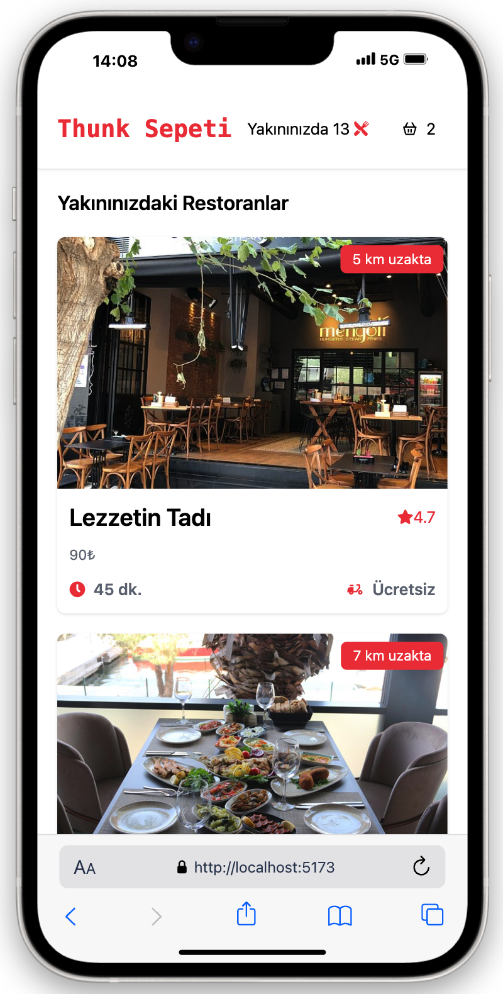

# THUNK SEPETİ 🛒

THUNK SEPETİ is a fully responsive e-commerce shopping cart application built with **React** and **json-server**. It is designed to simulate an online shopping experience and demonstrates the use of **Redux Thunk** for asynchronous state management.

---

## 🔧 Technologies & Libraries Used

- **React**
- **React Router DOM**
- **React Redux**
- **Redux**
- **Redux Thunk**
- **Axios**
- **React Icons**
- **React Toastify**
- **uuid**
- **Tailwind CSS**
- **json-server**

---

## 📦 Features

- Add, remove, and update products in the cart
- Toast notifications for user actions
- Asynchronous data fetching via Redux Thunk
- Local mock backend using json-server
- Fully responsive layout
- Clean and intuitive UI
- Organized folder structure

---

## 🚀 Getting Started

1. Clone the repository:

   ```bash
   git clone https://github.com/Bahadir34/thunk-sepeti.git
   cd thunk-sepeti
   ```

2. Install dependencies:

   ```bash
   npm install
   ```

3. Start the JSON server:

   ```bash
   npx json-server --watch db.json --port 5000
   ```

4. Run the React app:

   ```bash
   npm start
   ```

---

## 🖼️ Project Views





## 📌 Notes

- This project is **not for commercial use**.
- It is built purely for educational and personal development purposes.
- The design is mobile-first and responsive across all screen sizes.

---

## 📫 Contact

GitHub: [Bahadir34](https://github.com/Bahadir34)
